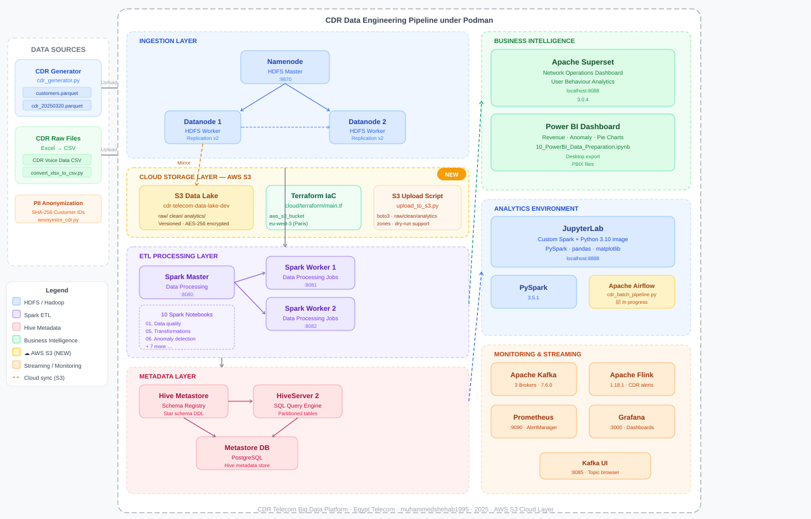
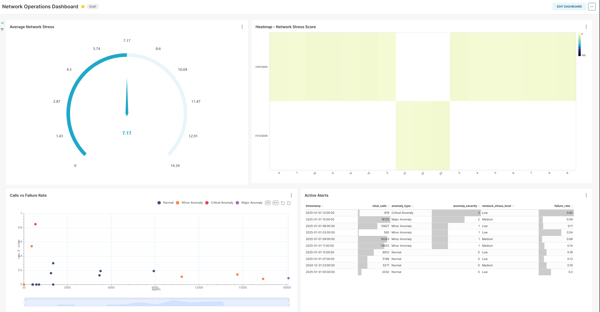
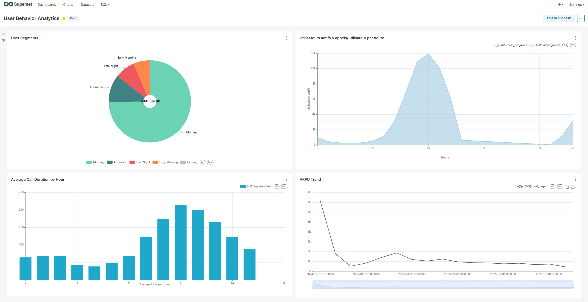
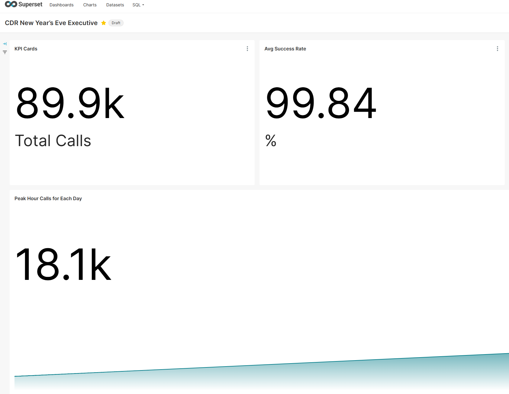
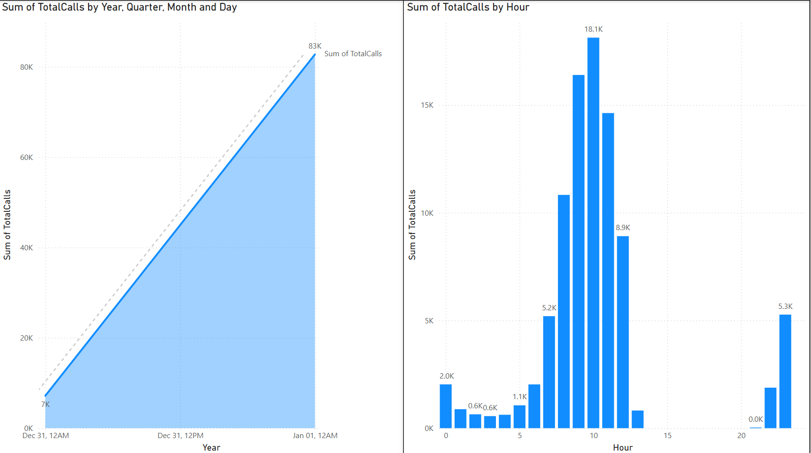
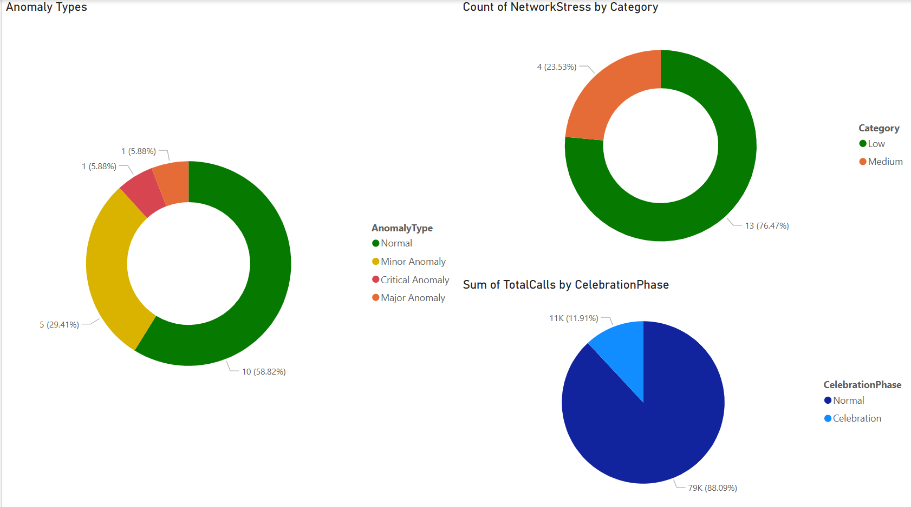
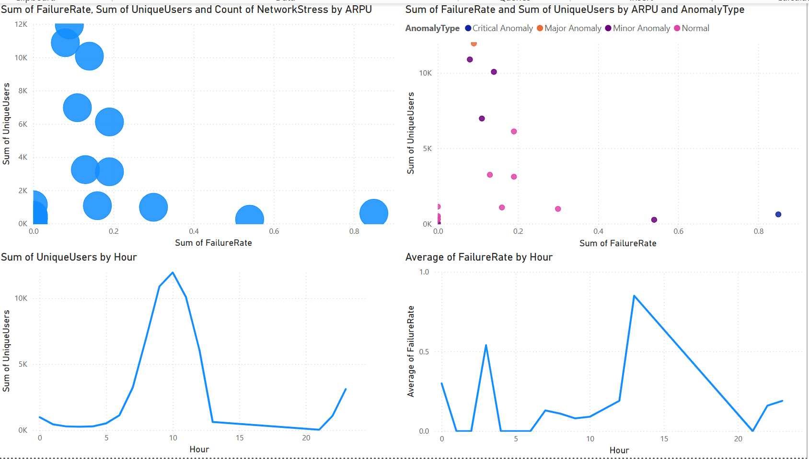

# CDR Telecom Big Data Platform — Data Engineering Zoomcamp Project

Data Engineering Project · Telecom CDR Platform · 2026
**GitHub: [muhammedshehab1995](https://github.com/muhammedshehab1995/Telecom-CDR-Bigdata-Project)**

An end-to-end, containerized **batch + streaming + cloud** pipeline for CDR processing and analysis, built with Docker Compose, HDFS, JupyterLab, Hive, Spark, Kafka, Flink, Superset, Grafana, Prometheus, AlertManager, and **AWS S3 as the cloud data lake (Terraform)**.

---

## 🔍 Overview

- **Real CDR Data**: Ingest FTTH / ADSL / 4G-LTE voice & data logs → EDA → Hive tables → transformations → BI dashboards
- **Safe-by-Design CDRs**: Realistic generator with Egyptian governorates and operators (Vodafone Egypt, Orange Egypt, Etisalat Egypt, WE Telecom)
- **PII-Anonymized**: SHA-256 hashing of all customer identifiers
- **Star Schema**: One `customer` dimension + usage & billing fact tables
- **AWS S3 Data Lake**: Three-zone lake (`raw` / `clean` / `analytics`) provisioned via Terraform with versioning and AES-256 encryption
- **Streaming Pipeline**: Zookeeper → 3× Kafka Brokers → Kafka-UI → Flink → Prometheus / Grafana → Postgres sink
- **Batch Pipeline**: HDFS → Spark → Hive → JupyterLab notebooks → Superset dashboards
- **Monitoring**: Prometheus + Grafana with 7 pre-built dashboards + AlertManager

---

## 🏗️ Architecture

<center>



</center>

- **Custom Hybrid**
  - **Batch** (Spark → Hive → S3) for analytics
  - **Streaming** (Kafka → Flink → Postgres) for real-time alerts
  - **Cloud Layer** (AWS S3, 3 zones: raw / clean / analytics) provisioned via Terraform
- **Lambda-Ready**: batch and speed views can be merged via a serving layer

---

## ⚙️ Tech Stack

| Layer | Tools & Versions |
|---|---|
| **Cloud Storage** | AWS S3 (Terraform IaC) — `main.tf` |
| **Ingestion** | Hadoop HDFS 3.4.1 (Namenode + 2 Datanodes) |
| **Batch Processing** | Spark 3.5.1, Hive 4.0.0 (Postgres metastore) |
| **Streaming** | Kafka 7.6.0 (3 brokers), Flink 1.18.1, Kafka-UI |
| **Orchestration** | Apache Airflow 2.9.0 |
| **Notebooks** | JupyterLab + PySpark (Python 3.10, custom Spark image) |
| **BI & Dashboards** | Superset 3.0.4, Power BI Desktop, Grafana |
| **Monitoring** | Prometheus, Grafana, AlertManager |
| **Container** | Docker Compose / Podman Compose |
| **IaC** | Terraform >= 1.3.0 |

---

## 📂 Repo Structure

```text
cdr-telecom-bigdata-platform/
├── main.tf                          # Terraform: AWS S3 data lake (3 zones + IAM policy)
├── upload_to_s3.py                  # Upload CDR Parquet/CSV files to S3
├── README.md
├── airflow /
│ └── dags /
│ │ ├── cdr_batch_pipeline.py        # 3-task DAG: ingest → features → S3 upload
│ │ └── cdr_cleaning.py
├── batch /
│ ├── docker-compose-batch.yml       # HDFS, Hive, Spark, JupyterLab, Superset, Airflow
│ ├── hadoop /
│ │ └── config /                     # core-site.xml, hdfs-site.xml, log4j.properties
│ ├── Hive /
│ │ └── hive-site.xml
│ ├── Jupyter /
│ │ ├── Dockerfile                   # Custom Spark + Python 3.10 JupyterLab image
│ │ └── notebooks /
│ │ │ └── work /
│ │ │ │ ├── scripts /
│ │ │ │ │ └── spark_init.py
│ │ │ │ └── spark-apps /
│ │ │ │ │ ├── 01_Data_Ingestion_Validation.ipynb
│ │ │ │ │ ├── 02_Customer_Dimension_Analysis.ipynb
│ │ │ │ │ ├── 03_Hive_Tables_Creation.ipynb
│ │ │ │ │ ├── 04_CDR_Exploratory_Analysis.ipynb
│ │ │ │ │ ├── 05_Data_Transformations_Engineering.ipynb
│ │ │ │ │ ├── 06_Anomaly_Detection_Engineering.ipynb
│ │ │ │ │ ├── 07_Trend_Analysis_Forecasting.ipynb
│ │ │ │ │ ├── 08_Network_Performance_Analytics.ipynb
│ │ │ │ │ ├── 09_Business_Intelligence_Metrics.ipynb
│ │ │ │ │ ├── 10_PowerBI_Data_Preparation.ipynb
│ │ │ │ │ └── dashboards /
│ │ │ │ │ │ └── exports /
│ └── spark /
│ │ └── config /
│ │ │ └── spark-defaults.conf
├── streaming /
│ ├── docker-compose-streaming.yml   # Zookeeper, Kafka x3, Flink, Grafana, Prometheus
│ ├── flink /
│ │ └── cdr_flink_job.py
│ ├── kafka /
│ │ ├── producer /
│ │ │ ├── cdr_stream_gen.py          # Live Egyptian CDR event generator
│ │ │ └── streaming_config.json      # Egyptian operators & governorates config
│ │ └── consumer /
│ │ │ └── example_consumer.py
│ └── monitoring /
│ │ ├── config /
│ │ │ ├── jmx-exporter-broker1.yml
│ │ │ ├── jmx-exporter-broker2.yml
│ │ │ └── jmx-exporter-broker3.yml
│ │ ├── grafana /
│ │ │ └── dashboards /
│ │ │ │ ├── files /                  # 7 pre-built Grafana dashboard JSONs
│ │ │ │ └── dashboard-provisioning.yml
│ │ │ └── datasources /
│ │ └── prometheus /
│ │ │ ├── alertmanager /
│ │ │ ├── rules /
│ │ │ └── prometheus.yml
├── scripts /
│ └── setup /
│ │ ├── generate_data.sh
│ │ ├── enriching_data.py
│ │ ├── cleaning_v2_cdr_data.py
│ │ └── convert_xlsx_to_csv.py
├── config /
│ ├── generator-config.json
│ └── pipeline-config.json
└── docs /
│ ├── data_schema.md
│ └── requirements.txt
```

---

## ✅ Prerequisites

Before starting, make sure you have installed:

- **Docker** + **Docker Compose v2** (or Podman + Podman Compose)
- **Python 3.9+** with `pip`
- **Terraform >= 1.3.0**
- **AWS CLI** configured with an IAM user that has S3 + IAM permissions
- **16 GB RAM** minimum (batch stack runs several heavy services simultaneously)
- **Git**

---

## 🚀 How to Run — Step by Step

### 1. Clone the Repository

```bash
git clone https://github.com/muhammedshehab1995/cdr-telecom-bigdata-platform.git
cd cdr-telecom-bigdata-platform
```

---

### 2. Provision the AWS S3 Data Lake with Terraform

This creates your S3 bucket with three zones (`raw/`, `clean/`, `analytics/`), versioning, AES-256 server-side encryption, and a read/write IAM policy. All public access is blocked.

```bash
# Set your AWS credentials as environment variables (never hard-code them)
export AWS_ACCESS_KEY_ID=your_access_key_here
export AWS_SECRET_ACCESS_KEY=your_secret_key_here
export AWS_DEFAULT_REGION=me-south-1

# Initialize Terraform (downloads the AWS provider)
terraform init

# Preview what will be created
terraform plan

# Apply — creates the bucket and IAM policy
terraform apply -auto-approve
```

You should see this at the end:

```
Outputs:
s3_bucket_name   = "cdr-telecom-data-lake-dev"
s3_bucket_arn    = "arn:aws:s3:::cdr-telecom-data-lake-dev"
s3_bucket_region = "me-south-1"
```

Verify your bucket exists:

```bash
aws s3 ls s3://cdr-telecom-data-lake-dev/
```

---

### 3. Generate and Prepare CDR Data

```bash
cd scripts/setup

# Generate synthetic Egyptian CDR data
bash generate_data.sh

# Enrich with governorate, operator, and network metadata
python3 enriching_data.py

# Clean and validate — removes duplicates, fixes timestamps, flags anomalies
python3 cleaning_v2_cdr_data.py
```

This creates data files organized as:
- `data/raw/` — raw CDR records (Parquet + CSV)
- `data/clean/` — validated and PII-anonymized CDRs
- `data/analytics/` — aggregated outputs ready for BI

---

### 4. Upload Data to AWS S3

```bash
cd ../..
pip install boto3 tqdm

# Dry run first — see what will be uploaded without uploading
python3 upload_to_s3.py \
  --source ./data \
  --bucket cdr-telecom-data-lake-dev \
  --region me-south-1 \
  --dry-run

# When satisfied, upload for real
python3 upload_to_s3.py \
  --source ./data \
  --bucket cdr-telecom-data-lake-dev \
  --region me-south-1
```

Expected output:
```
🔍 Scanning ./data for CDR files …
📦 Found 12 file(s) to upload → s3://cdr-telecom-data-lake-dev/
✅ Upload complete: 12 succeeded, 0 failed.
```

Verify the zones in S3:
```bash
aws s3 ls s3://cdr-telecom-data-lake-dev/raw/
aws s3 ls s3://cdr-telecom-data-lake-dev/clean/
aws s3 ls s3://cdr-telecom-data-lake-dev/analytics/
```

---

### 5. Start the Batch Stack

Create the shared Docker network, then launch all batch services (HDFS, Hive, Spark, JupyterLab, Superset, Airflow):

```bash
# Create the network (only needed once)
docker network create datastack-net

cd batch
docker compose -f docker-compose-batch.yml up -d --build
```

Wait about 60–90 seconds for all services to become healthy. Check status:

```bash
docker compose -f docker-compose-batch.yml ps
```

All services should show `healthy` or `running`. If HDFS takes longer, wait another 30 seconds and check again.

Load your CDR data into HDFS:

```bash
# Enter the namenode container
docker exec -it namenode bash

# Inside namenode — create the directory structure
hdfs dfs -mkdir -p /data/raw
hdfs dfs -mkdir -p /data/clean
hdfs dfs -mkdir -p /data/analytics
hdfs dfs -mkdir -p /user/hive/warehouse

# Upload your CDR data files
hdfs dfs -put /mnt/data/raw/*   /data/raw/
hdfs dfs -put /mnt/data/clean/* /data/clean/

# Verify the upload
hdfs dfs -ls /data/raw/

# Exit the container
exit
```

---

### 6. Start the Streaming Stack

```bash
# Create the streaming network (only needed once)
docker network create streaming_net

cd ../streaming
docker compose -f docker-compose-streaming.yml up -d
```

Wait about 30 seconds for Kafka brokers to elect a leader and become ready. Check:

```bash
docker compose -f docker-compose-streaming.yml ps
```

Verify Kafka brokers are up by opening Kafka-UI at **http://localhost:8085** — you should see 3 brokers listed under the `local` cluster.

---

### 7. Start the CDR Kafka Producer

Open a new terminal and start the live CDR event generator. It produces realistic Egyptian CDR events and publishes them to Kafka topics in real time.

```bash
cd streaming/kafka/producer

# Install producer dependencies
pip install kafka-python numpy prometheus-client

# Start the producer
python3 cdr_stream_gen.py --config streaming_config.json
```

You should see output like:

```
[INFO] CDR_STREAM_GEN: Connected to Kafka brokers: broker1:29092, broker2:29093, broker3:29094
[INFO] CDR_STREAM_GEN: Producing CDR events for 30,000 Egyptian subscribers...
[INFO] CDR_STREAM_GEN: 1000 events sent | Throughput: 487 events/sec
```

Keep this terminal running. Monitor topics live at **http://localhost:8085**.

---

### 8. Run the Batch ELT Notebooks in JupyterLab

Open **http://localhost:8888** in your browser and navigate to `work/spark-apps/`.

Run the notebooks **in order**, top to bottom, using **Kernel → Restart & Run All** for each:

| # | Notebook | What It Does |
|---|---|---|
| 01 | Data_Ingestion_Validation | Ingests raw CDRs from HDFS, validates schema, runs quality checks |
| 02 | Customer_Dimension_Analysis | Builds and profiles the customer dimension table |
| 03 | Hive_Tables_Creation | Creates all Hive DDL, partitioned zones, and external tables |
| 04 | CDR_Exploratory_Analysis | Full EDA: distributions, missing values, outlier detection |
| 05 | Data_Transformations_Engineering | Feature engineering, hourly/daily aggregates, service trends |
| 06 | Anomaly_Detection_Engineering | Flags anomalous usage patterns using statistical thresholds |
| 07 | Trend_Analysis_Forecasting | Network trend metrics and time-series forecasting |
| 08 | Network_Performance_Analytics | Cell-level KPIs: signal strength, latency, QoS |
| 09 | Business_Intelligence_Metrics | Revenue, churn, ARPU, and BI-ready aggregations |
| 10 | PowerBI_Data_Preparation | Exports clean Parquet files for Power BI and Superset |

Each notebook builds on the previous one. Do not skip or reorder them on the first run.

---

### 9. 📊 View Grafana Dashboards (Streaming)

Open **http://localhost:3000**
- Username: `admin`
- Password: `admin`

All 7 dashboards load automatically (pre-provisioned):

| Dashboard | What It Shows |
|---|---|
| CDR Streaming Overview | Events/sec, Kafka lag, topic throughput |
| CDR Business Analytics | Revenue by operator, session counts, data usage |
| CDR Network Quality Map | Cell-level signal strength and QoS metrics |
| CDR Anomaly Trends | Anomaly rate and alert frequency over time |
| CDR Churn Analysis | Churn risk scores by segment and governorate |
| CDR Fraud Risk Analytics | Suspicious usage patterns and fraud flags |
| CDR Top Cells Revenue | Top 20 revenue-generating cell towers by governorate |

---

### 10. 📊 View Superset Dashboards (Batch Analytics)

Open **http://localhost:8088**
- Username: `admin`
- Password: `admin`

Pre-built dashboards include:

**Network Operations Dashboard**


**User Behavior Analytics**


**KPI Single-Value Cards**


---

### 11. Power BI Dashboards

After running notebook 10, export files are available in `batch/jupyter/notebooks/work/spark-apps/dashboards/exports/`. Open them in Power BI Desktop.





---

### 12. 📊 Monitor with Prometheus and AlertManager

- **Prometheus**: http://localhost:9090 — query CDR metrics directly
- **AlertManager**: http://localhost:9093 — view and silence active alerts

Pre-configured alert rules in `streaming/monitoring/prometheus/rules/cdr_alerts.yml` fire when:
- Kafka consumer lag exceeds threshold
- CDR event rate drops unexpectedly
- A governorate cell cluster shows QoS degradation
- Anomaly rate spikes above 10% per 5-minute window

---

## 📡 Service Endpoints

| Service | URL | Login |
|---|---|---|
| **HDFS NameNode UI** | http://localhost:9870 | — |
| **Spark Master** | http://localhost:8080 | — |
| **Spark Worker 1** | http://localhost:8081 | — |
| **Spark Worker 2** | http://localhost:8082 | — |
| **JupyterLab** | http://localhost:8888 | — |
| **Superset** | http://localhost:8088 | admin / admin |
| **Airflow** | http://localhost:8070 | admin / admin |
| **Kafka UI** | http://localhost:8085 | — |
| **Flink JobManager** | http://localhost:8081 | — |
| **Grafana** | http://localhost:3000 | admin / admin |
| **Prometheus** | http://localhost:9090 | — |
| **AlertManager** | http://localhost:9093 | — |
| **Postgres Exporter** | http://localhost:9187 | — |
| **Kafka Exporter** | http://localhost:9308 | — |
| **JMX Exporter 1** | http://localhost:5556 | — |
| **JMX Exporter 2** | http://localhost:5557 | — |
| **JMX Exporter 3** | http://localhost:5558 | — |

---

## 🛑 Stopping All Services

```bash
# Stop batch stack
cd batch
docker compose -f docker-compose-batch.yml down

# Stop streaming stack
cd ../streaming
docker compose -f docker-compose-streaming.yml down

# Remove Docker networks
docker network rm datastack-net streaming_net

# (Optional) Destroy S3 bucket via Terraform — WARNING: deletes all data
cd ..
terraform destroy -auto-approve
```

---

## 🔧 Troubleshooting

**HDFS namenode not starting**: Run `docker exec -it namenode bash` and check `hdfs namenode -format` was completed. Look at logs with `docker logs namenode`.

**Kafka brokers not connecting**: The broker envs use `localhost` for the external listener. If you run producer outside Docker, this is correct. Inside Docker use `broker1:29092`.

**JupyterLab kernel dies on Spark session**: Increase Docker memory to at least 8 GB in Docker Desktop settings, then restart the container.

**Superset shows no charts**: Make sure you have run notebook 10 first and that the Postgres connection string in Superset settings points to `superset-db:5432`.

**S3 upload fails with credentials error**: Double-check `AWS_ACCESS_KEY_ID` and `AWS_SECRET_ACCESS_KEY` are exported in your current shell session.

---

## 🏛️ Key Design Decisions

- **AWS S3** replaces local file storage for all three zones, enabling durable and scalable cross-service data sharing with zero extra infrastructure.
- **Terraform** provisions S3 with versioning, encryption, and strict public-access blocking as code — reproducible in any environment.
- **Lambda architecture**: Kafka + Flink handle the real-time speed layer; Spark + Hive handle the batch layer. Postgres serves as both Hive metastore and Flink streaming sink.
- **Airflow DAG** now has three tasks (`spark_ingest_and_clean → spark_feature_engineering → upload_analytics_to_s3`), wiring the batch pipeline directly to S3.

---

## 🤝 Contributing

1. Fork and create a feature branch
2. Add tests, documentation, or code
3. Submit a pull request

---

## 📄 License

This project is licensed under the [Apache License 2.0](LICENSE).

---

*CDR Telecom Big Data Platform · Egypt · [muhammedshehab1995](https://github.com/muhammedshehab1995) · 2025*
